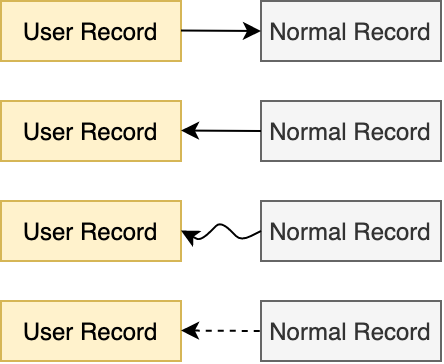
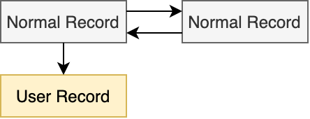
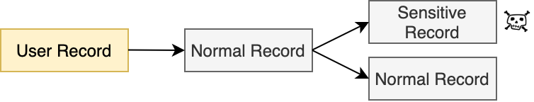
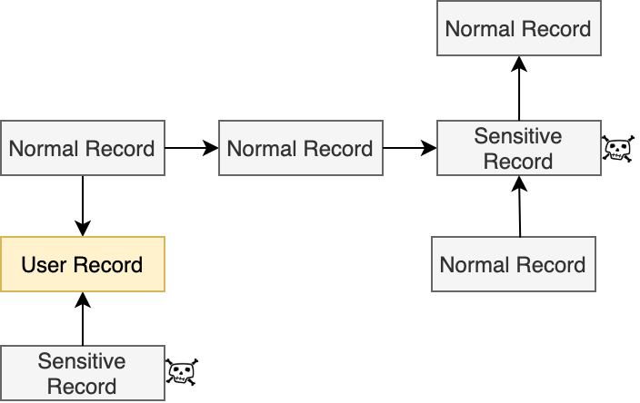
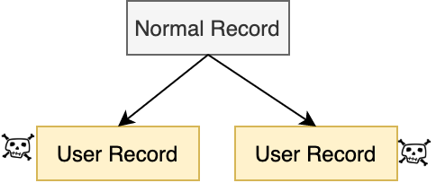
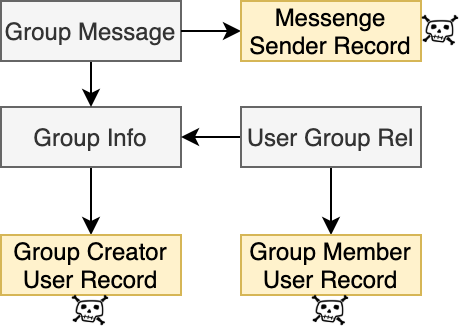
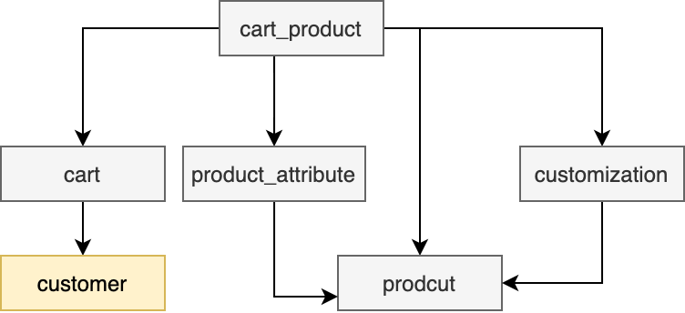
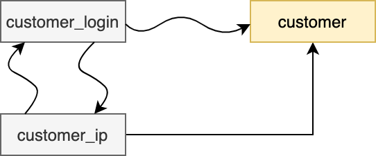
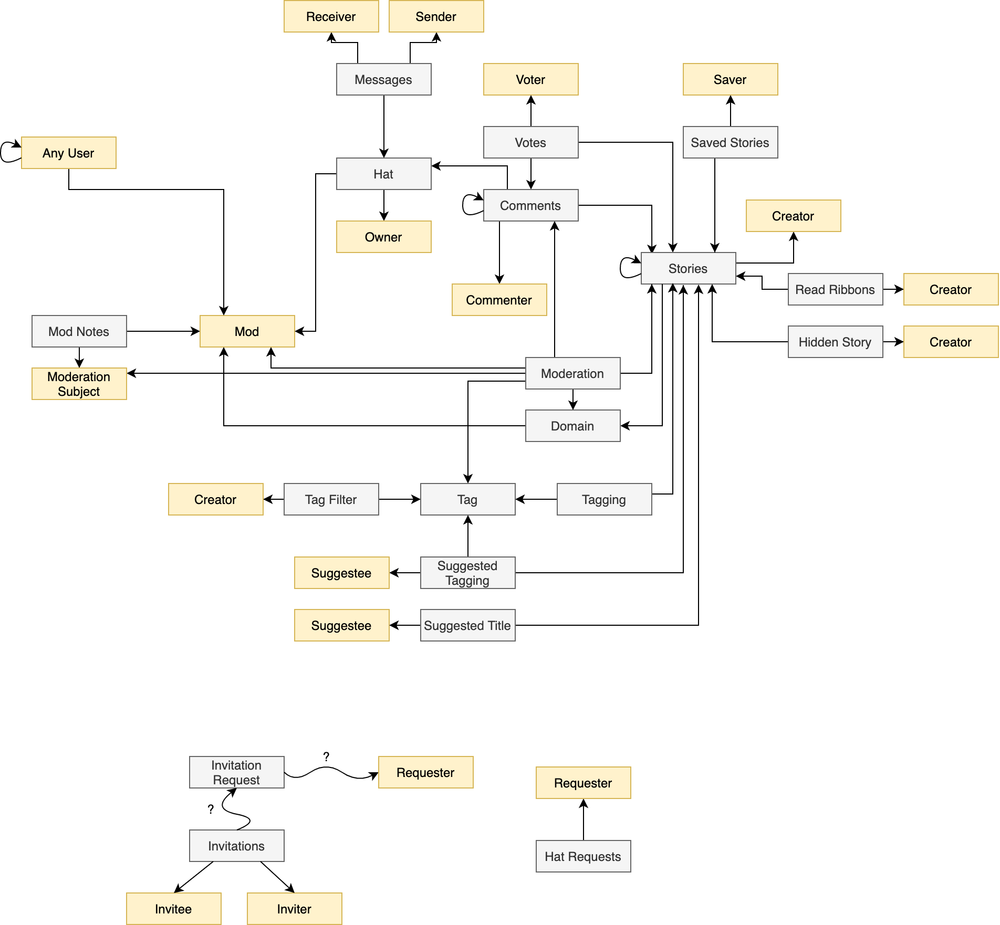
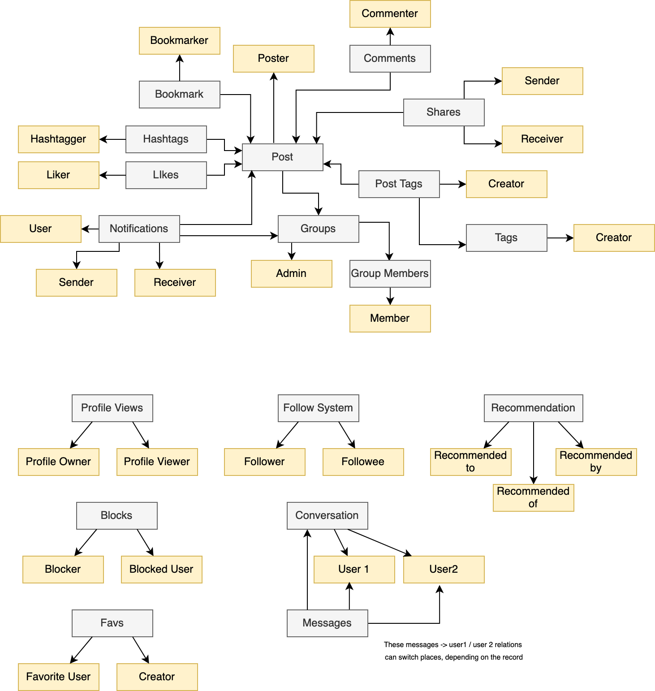

After doing some benchmarks (the physical sharding benchmarks, the index
stress tests, and the logical sharding benchmarks), we started to have other ideas
for sharding mechanisms. 

One hypothetical system is one that infers links inbetween rows by tracking the of joins and sub-queries.

A better understanding of how databases are structured in practice is needed to properly inform the design of the hypothetical systems.

This folder contains info on certain schemas of open-source applications that we analyzed. The 'permalinks' are future-proof links to the schema files at the state at which we analysed them. Physical copies are also in the `schemas` folder (needless to say, you should check the repo licenses before using these for anything more than educational purposes).

# The schemas we looked at

- [Lobsters (sql)](https://github.com/mit-pdos/noria/blob/master/applications/lobsters/mysql/db-schema/original.sql) - [permalink](https://github.com/mit-pdos/noria/blob/f54dfcef4057b490ccb43f4a31c6aaf35c923fb7/applications/lobsters/mysql/db-schema/original.sql)
- [Lobsters (rb)](https://github.com/lobsters/lobsters/blob/master/db/schema.rb) - [permalink](https://github.com/lobsters/lobsters/blob/4755cebd9259baebacc14e5d4d98540bf9836b94/db/schema.rb)
- [Socify (rb)](https://github.com/scaffeinate/socify/blob/master/db/schema.rb) - [permalink](https://github.com/scaffeinate/socify/blob/19d02bb72685cfb64d81bd5d2b088177b4086436/db/schema.rb)
- [GhChat (sql)](https://github.com/aermin/ghChat/blob/master/server/init/sql/ghchat.sql) - [permalink](https://github.com/aermin/ghChat/blob/8eb7ed5b484ed9970c10ff6ddf1b795fcd7235f4/server/init/sql/ghchat.sql)
- [Instagram Clone (sql)](https://github.com/yTakkar/Instagram-clone/blob/master/instagram.sql) - [permalink](https://github.com/yTakkar/Instagram-clone/blob/eec6420e47c27f30939515c46f8138aebd38c529/instagram.sql)
- [Instagram Clone 2.0 (sql)](https://github.com/yTakkar/React-Instagram-Clone-2.0/blob/master/db.sql) - [permalink](https://github.com/yTakkar/React-Instagram-Clone-2.0/blob/1128f7fad8df371ec0b7901a150a710396f9f42a/db.sql)
- [HotCRP Paper review system (sql)](https://github.com/kohler/hotcrp/blob/master/src/schema.sql) - [permalink](https://github.com/kohler/hotcrp/blob/a5956110e9eef7dea832a1cd19d8119b512ae897/src/schema.sql)
- [Schnack (sql)](https://github.com/schn4ck/schnack/tree/master/migrations) - [permalink](https://github.com/schn4ck/schnack/tree/71feb6053d9f85385c507fe0166c72119e6bc7c6/migrations)
- [Commento (sql)](https://github.com/adtac/commento/blob/master/db/20180416163802-init-schema.sql) - [permalink](https://github.com/adtac/commento/blob/326601394acd8fface90990fae63236ffa880bc4/db/20180416163802-init-schema.sql)
- [Mouthful (sql in Go)](https://github.com/vkuznecovas/mouthful/blob/master/db/sqlxDriver/postgres/postgres.go) - [permalink](https://github.com/vkuznecovas/mouthful/blob/7a850ecd117e73a701fd56151dc7dbfd45d82139/db/sqlxDriver/postgres/postgres.go)
- [PrestaShop (sql)](https://github.com/PrestaShop/PrestaShop/blob/develop/install-dev/data/db_structure.sql) - [permalink](https://github.com/PrestaShop/PrestaShop/blob/9f71f3294867db49880c0d737bd559f2dd822e78/install-dev/data/db_structure.sql)
- [OpenCart (php)](https://github.com/opencart/opencart/blob/master/upload/system/helper/db_schema.php) - [permalink](https://github.com/opencart/opencart/blob/c4d4f01948d0d75575eb47b44d15b89474f2926b/upload/system/helper/db_schema.php)
  (These guys seem to have GDPR compliance baked into their codebase with a dedicated gdpr table
  and several `gdpr.php` scripts. Potentially worth investigating.)

If you'd like to see more schemas for Ecommerce solutions, take a look at [this list](https://www.ecommerceceo.com/open-source-ecommerce/). 

## Schema Visualization And Analysis Tools
We simply just read the source directly, but if you'd like to visualize or further process
these schemas, these tools might come in handy:
- [PgLoader (MySQL to Postgres)](https://github.com/dimitri/pgloader)
- [SQLdm.com (ER diagrams from SQL schemas)](https://app.sqldbm.com/)
- [Railroady (ER diagrams Ruby schemas)](https://github.com/preston/railroady)

# Report from Our Findings

(Apologies if this is a bit lengthy! One's mind can really go down a rabbit hole when thinking about systems.)

## Explaining our Hypothetical System

First, it would be beneficial to explain in a bit more detail the type of system we were think of when these schemas were analysed. We were trying to conceptualize a logical shading system that can infer foreign key (FK) links between tables in databases where actual foreign keys were not used. If a system were able to achieve this, then it would have a map of locations as to where information pertaining to a particular user is, and hence it would be able to respond to SARs effectively and automatically. This 'map' can also be thought of as a graph.

Some ways this system could guess foreign key links is through the naming patterns of the columns in the databases (for example, the system could guess that a column named `customer_id` should be a foreign key to the `customer` table), or by keeping track of the use of joins and subqueries.

Now, assuming that this system could effecting infer all these links, there are three ways it can decide to handle this constructed map. 

1. The first method is to automatically make indexes on each of the tables that end up being part of the map. So, for example, if the system figures out that `customer_id` in the `purchases`  table is a FK to the `customers` table, then it would automatically make an index on the `purchases` table on the `customer_id` field. Once a customer submits an SAR, the system would perform queries on all the automatically generated indexes (though these queries might not always correlate to the ID of the customer; more on that later), and report all the results.
2. The second method is similar to method 1, but instead of having one index per table, the system would use a custom composite table that contains all the information needed to respond to any SAR. Such an index would likely contain nested indexes grouped by user ID.
3. Lastly, it could decide not to use indexes at all. Instead, it could decide to crawl the map on demand when an SAR is submitted, going through all the links and collecting all the records that are needed. As will be explained, this system has more pitfalls than the first too, but saves space and prevents possible write overheads of additional indexes.

## Motivation

So, this report is meant to be a report to give anyone who is designing or implementing any of these systems an idea of certain pitfalls and caveats of the problem space.

## Assumptions

We assume that the schema contains a single table with one row for each user, which we refer to as the _User Record_. User records typically contain at least some ssensitive information, such as a password hash.

## The patterns observed

 This diagram shows the 4 different types of FK links that we saw in the schemas that we observed. They'll be explained from top to bottom:

**Forward Link (FL)**: This is a FK link that points further away from the user record. It can also be from between two normal records, but the main point is that the link flows from a record that is "closer" to the user's record (in the users table) to one that is "further" (in terms of the number of steps taken).

**Backwards Link (BL)**: These are essentially the opposite of FLs, and they can also be between two normal records. So, they flow from a record that is further from a user record to one that is closer.

**Inferred Link (IL)**: In practice, these were only observed to be BLs, but in theory they can also be FLs as well. Inferred links are links between tables that use something other than the primary key of the table being linked (like, for example, linking to the users table using `email` instead of `user_id`).

**Ghost Link (GL)**: These are essentially non-existent links that *should* exist between tables, but don't. A classic example is a table that stores IPs and sessions but doesn't give information about which user performed which session. This is a problem that can't be solved by our hypothetical system, but is still something we kept note of.

Examples of maps with all of these will be shown later (all from the schemas we observed).

So, in general, it was observed that BLs are more common than FLs, and FLs coming directly from a user record are especially uncommon. Inferred links (and especially ghost links) in general were very uncommon, but did occur nonetheless (e.g., in session recording).

## Immediate Things to Think About

So from just understanding these 4 link types and causally linking through the schemas, some problems (some trivial, others not) come to mind. An SAR map of a relatively large schema is going to have all 4 of these links , which means that the system is going to have to be able to follow both chains that contain several BLs and FLs. This isn't a particularly difficult problem, but is still something to think about.

Cycles are also an issue, but that's a very standard problem for anything that handles graph traversal. Simply keeping track of all records (not tables) that have been visited before should suffice. Just for the sake of thoroughness, however, an example of a cyclic map will be shown later.

A more significant issue comes to light when one considers considers security. Imagine the below map:

The record with the skull near it is a record that contains sensitive information that the SAR has no business knowing (server configurations, password hashes, IP addresses, whatever). If the wrong decision is made by the system, this sensitive information could be reported in the SAR (which would be a security breach). In this map, without the intervention of the schema designer, there's no reason for the system not to return the full results of both leaf records. It would not be enough to just completely ignore records with sensitive information, however. That could leave certain parts of the map completely unaccessible because links that lead to or come from the blocked our records will be lost. Additionally, those records could have information that *isn't* sensitive and needs to be reported in the SAR. Below is a hypothetical example of a map where both of these possibilities are true:

In this map, there are FLs and BLs that point to/from to records with sensitive information. So, to ensure those links don't get lost, partial making of information is needed. Of course, which information should be redacted should be set by the schema designer (in the form of simple table metadata, perhaps).

A very common occurrence where this type of logic would matter is when a record has Backward Links to two separate user records: 

This map illustrates the needed not only for partial redacting, but also for user-dependent redacting (where which records that are redacted depends on the identity of the submitter). Here are some examples of the many occurrences of this pattern in the schemas we observed.

https://github.com/andersonaddo/compliance-by-design-experiments/blob/ba9780b2748e11d1bbeb618419ba338c6860b87a/schema_analysis/schemas/lobsers.rb#L94-L105

https://github.com/andersonaddo/compliance-by-design-experiments/blob/ba9780b2748e11d1bbeb618419ba338c6860b87a/schema_analysis/schemas/isntagram%202.0.sql#L29-L34

https://github.com/andersonaddo/compliance-by-design-experiments/blob/ba9780b2748e11d1bbeb618419ba338c6860b87a/schema_analysis/schemas/ghchat.sql#L77-L87

https://github.com/andersonaddo/compliance-by-design-experiments/blob/ba9780b2748e11d1bbeb618419ba338c6860b87a/schema_analysis/schemas/instagram.sql#L912-L917

## Problems & Points from Specific Examples

### Entry Points and Chosen Paths

Below is a map that displays the majority of the [ghChat schema](schemas/ghchat.sql ). It's recommended you read the schema first before you proceed.  

This map introduces a new problem, one that is unique to an on-demand crawler implementation of this hypothetical local sharding system - **entry points**. Assuming a user submits an SAR for a map like this, there are three paths that the crawler could take:

1. It could enter the map from the Group Message Table. Then, flow use the user's ID to flow into the Group Info table, then go into the User's table to get information about the group creator (which will probably be redacted), the again use the user's ID and the necessary groups IDs found in the Group Info table to find the necessary info in the User Group Rel table (and maybe  add information from members of the groups that the SAR subject is also a part of).
2. The system could also decide to enter the map through the User Group Rel table, use the groups IDs found there to go into the Group Info Table, then use the IDs there to go into the Group Message table (all while going to get redacted records from the user table, if necessary).
3. Lastly, the system could take a similar path as option 2, but instead using the Group Info table as the entry point.

Depending on how the system keeps track of the IDs that it should be using in subsequent queries, there could be problems with options 2 and 3, particularly because messages sent by the SAR subject to groups he/she is no longer a member of could be accidentally skipped or lost. This also depends on how the systems treats Forward Links and Back Links. Suffice to say, for an on-demand crawler, the order of traversal, the management of IDs currently being tracked, and the distinction of FLs and BLs matters more.

Index based approaches could also suffer from similar problems. Though the messages are still going to be in the indexes after the user has left, the issue of entry points and which paths to take could affect which columns are chosen to be indexed by the automatically generated indexes, and queries that are automatically generated for the SAR queries. Approach 2 would suffer less from this, because when an SAR is submitted, less queries have to be performed - you just submit everything in the nested index structure that's in that user's ID group. But approach 1 could face some issues, since lots of queries have to be performed to generate the SAR form the automatically generated index.

One way to possibly solve this for Approach 1 would be so make custom index types (rather than the build in Postgres generics like hash indexes or btree indexes) where reach row is stored in the index not by a particular column they have, but just by the user they belong to. So, for example, assume you have a table `likes`, which has the columns `post_id` and `post_liker` . Assuming the SAR sender is the author of this liked post, instead of making an index that indexes `post_id` (which could be tranced back to the SAR sender's user record via some map path), you could make an index that ads a virtual column to the table called `post_owner` which correlates to the post owner directly. This way, the concept of choosing a tracing path (which could end up missing things due to changes over time) isn't needed - you can just use virtual columns within each table, similar to `Select * from table where [virtual_index_name] = x`.

This is a relatively nuanced problem, and is worth thinking about.

### Cycles

As stated before, cycles are trivial, but for the sake of thoroughness, a real life example of one is still provided below. This is from the [PrestaShop Schema](schemas/PrestaShop.sql).

Here is a link of one table that's involved in the cycle (so you can trace for yourself):

https://github.com/andersonaddo/compliance-by-design-experiments/blob/ba9780b2748e11d1bbeb618419ba338c6860b87a/schema_analysis/schemas/PrestaShop.sql#L314

### Long Links of Necessary Information 

It's also worth noting that for certain large schemas, following all the links can lead to reporting a lot of completely unnecessary information in the SAR. This means that entire/partial redaction can be useful in preventing the SAR from being clogged with useless information. A good example are tables that refer to `cart_rule` in the [PrestaShop Schema](schemas/PrestaShop.sql).

### Inferred and Ghost Links

As stated before, ghost links and inferred links popped up during session tracking. For example, the `PREFIX_connections` table in the  [PrestaShop Schema](https://github.com/andersonaddo/compliance-by-design-experiments/blob/ba9780b2748e11d1bbeb618419ba338c6860b87a/schema_analysis/schemas/PrestaShop.sql#L506) records sessions and IP addresses, but doesn't seem to be directly or indirectly linked to customers (though it does, for some reason, seem linked to guest accounts).

[OpenCart's schema](schemas/opencart.php) had the issue of having inferred links in its session tracking design.

The `customer_login` table doesn't have any direct key references to the customer table, but it *does* seem to have columns that refer to customer emails and ips (hence the inferred link). Similarly, there seems to be inferred links via `ip` columns between the `customer_login` and `customer_ip` tables. However, nothing ever refers to the `customer_ip` table explicitly, so it's unclear how it fits into the higher schema.

Regardless, if session management is a common place to find ghost and inferred links, it's worth thinking how that could influence the design of a map generation system, since IP addresses are sensitive information that should be included in SAR requests.

## General Miscellaneous Thoughts

- One way to fix the path selection problem is to choose and maintain all/multiple paths and remove duplicate records in the end.
- Ghost and inferred links result in tables that should be part of an SAR map being excluded. To solve this retroactively, the program could compare all the tables in the database to the tables that ended up in the SAR map, and report the difference. Surely, a majority of those tables won't be in the map because they don't contain info that belongs in an SAR, but a few might not be present because of ghost and inferred links. If that's the case, they can be caught by the schema developer.
- Schemas seemed to have general patterns as to how they named their foreign keys. A way for the system to pick up on these patterns dynamically (with our without the help of the schema developer) would be promising.

## That's all Folks!

I hope this report has at least gotten your head jogging about the different caveats and gotchas of the problem space! The [Draw.io](https://app.diagrams.net/) diagrams have been made available in the `diagrams` folder, and thanks to [GIPHY](https://giphy.com) for the gifs :)

## Addendums 

These were added after the initial report as our explorations continued.

### #1

We decided to add some diagrams or larger schemas than just ghChat. So we're added full SAR maps for [Instagram2.0](schemas/isntagram 2.0) and [Lobsters](schemas/lobsters.rb). To prevent clogging, we decided not to add skulls to all the user record nodes (which were the only sensitive nodes in both maps), but assume that there's one next to each.

Here's the map for Lobsters:

<kbd>

</kbd>

And here's the diagram for Instagram 2.0:

<kbd>

</kbd>

### #2

So there are three useful insights to have here:

1. It's worth noting that even though these SAR maps are presented as directed graphs, for all intents and purposes they are undirected. One can traverse a forward link or a back link in any direction; the only reason these edges are classified as forward or back is to indicate the direction in which their keys themselves point .

   For example, look at the SAR map for Instagram 2.0. Assume the system had constructed this map in its entirety, and now started its traversal. If it wanted to go from Comments to Posts, it would simply make a query like this:

   `select * from posts where id = <value of a comment id>`

   And if we wanted to from Post to comments (in the opposite direction of the edge), it would be a query like:

   `select * from comments where post_id = <value of a post id>`

   Of course this would only work if the graph is complete at the time of traversal, because at that point the system would know the source and destination of every edge.

2. It's also worth noting that it can't be safely assumed that any table only has to be visited once. For example, consider the comments table in the lobster map. The fastest way to get to that table would be from the commenter node (which is an alias for the user table). If you get to the comments table from there, then you'd pick up all the comments that that user posted. Assume that this user was also a mod, though, and that he has moderated a few abusive comments. Then, to get this information, you'd have to go from Mod > Moderation > Comments. 
3. Lastly, it worth noting that its also not entirely trivial to know when to end a traversal early. For example, if the system was compiling all the bookmarks that the user had created (in Instagram 2.0), it would traverse like so: Bookmarker > Bookmark > Post. After that, there's no real reason to continue the traversal, even though we haven't reached a leaf node to formally end it. There's also no reason so continue and traverse all the other branches that can flow from the Post node (like flowing into Hastags). If the system were to be compiling all the posts that the user posted themselves, it would go: Poster > Post. But should it flow into Shares as well? What about likes? It certainly shouldn't flow into notifications though, should it? That could be considered private.

Points 2 and 3 show that semantic and contextual information about the database and its graph is necessary to make traversal smart and efficient. The graph itself isn't enough. This type of information is not possible for a system to pick up automatically, and would be a hassle for the schema designer to define explicitly for the system. So, the system will likely have to explore *all* paths in *full* unless it is stopped by redaction.

This is a problem, because this essentially becomes a system that is attempting to explore all paths between all pairs of leaf nodes of an undirected graph. This is an explosive computation.